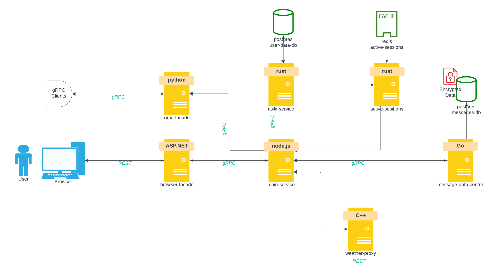

# Real-Time Chat Application

## Overview

This real-time chat application enables users to communicate with each other in real-time. It's built on a microservices architecture using Docker, with services written in Python, C#, and C++.



## Features

- User authentication and registration.
- Real-time text messaging.
- Analytics dashboard for message and user activity insights.

## Getting Started

### Prerequisites

- Docker
- Docker Compose

### Installation

1. Clone the repository to your local machine:

```bash
git clone https://github.com/yourusername/real-time-chat-app.git
cd real-time-chat-app
